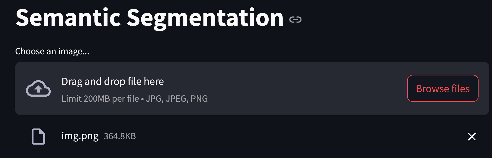

# Semantic Segmentation Streamlit App

This repository contains a Streamlit application for performing semantic segmentation on any image. The app supports three methods: basic thresholding, SegFormer, and Mask2Former models. Additionally, it allows users to save the segmented mask and the legend of the mask.

Note: 
1. You might have to provide your huggingface token for downloading the model from huggingface.
2. If you are installing streamlit for the first time, you might also have to provide your email id.

## Installation

To run this app locally, follow these steps:

1. Create a new conda environment and activate it.
    ```
    conda create -n <env_name> python=3.10
    conda activate <env_name>
    ```
2. Clone the repository:
    ```bash
    git clone https://github.com/hemanishah00/Segmentation.git
    ```
3. Navigate to the project directory:
    ```bash
    cd Segmentation
    ```
4. Install the required dependencies:
    ```bash
    pip install -r requirements.txt
    ```

## Usage

To start the Streamlit app, run the following command:
```bash
streamlit run app.py
```

## How to Use

1. Upload an image using the file uploader. Once uploaded you will be able to see the image displayed in the app.


2. Select the segmentation method (Basic Thresholding, SegFormer, or Mask2Former).


3. If you want to upload the mask, you can click on the Upload the mask checkbox, and upload the mask. You will be able to see the actual image and the segmented mask side by side on the app, once you upload it.


    Also provide the legend, you will be able to select from the categories the model you are using for segmentation provides with respect to the colors detected from the mask. Xlick on select colors once done.


4. Click the "Run Segmentation" button to perform segmentation. You should see results like:

without true mask uploaded


## Models

### Basic Thresholding

This method segments the image based on a simple threshold value. It is useful for quick and easy segmentation tasks. The results are not perfect in this case but it is the most basic and computationally effective way of doing semantic segmentation with just 2 categories. We are using binary and otsu thresholding as it adapts the thresholding method to varying contrast regions, resulting in an optimal binary image.

### SegFormer

SegFormer model fine-tuned on ADE20k at resolution 512x512. It was introduced in the paper [SegFormer: Simple and Efficient Design for Semantic Segmentation with Transformers](https://arxiv.org/abs/2105.15203) and first released in this [repository](https://github.com/NVlabs/SegFormer). I used this model as the dataset this model was finetuned on provides us with a varity of categories and is freely available on huggingface. SegFormer consists of a hierarchical Transformer encoder and a lightweight all-MLP decode head to achieve great results on semantic segmentation benchmarks such as ADE20K and Cityscapes. The hierarchical Transformer is first pre-trained on ImageNet-1k, after which a decode head is added and fine-tuned altogether on a downstream dataset.


### Mask2Former

Mask2Former is another state-of-the-art model for semantic segmentation, instance segmentation and panoptic segmentation. It combines the strengths of transformers and convolutional neural networks to achieve robust segmentation results. Its key components include masked attention, which extracts localized features by
constraining cross-attention within predicted mask regions. The Mask2Former model was proposed in [Masked-attention Mask Transformer for Universal Image Segmentation](https://arxiv.org/abs/2112.01527).


## Future work:
1. To calculate necessary metrics like iou and MAp to evaluate how good the model is. 
2. To save the data to a database and train it on a model to make it more user specific. Right now we are deleteing all the results and the user provided data once the app stops running, as a precaution to save memory. 

## Acknowledgements

- [Streamlit](https://streamlit.io/)
- [SegFormer](https://github.com/NVlabs/SegFormer)
- [Mask2Former](https://github.com/facebookresearch/Mask2Former)